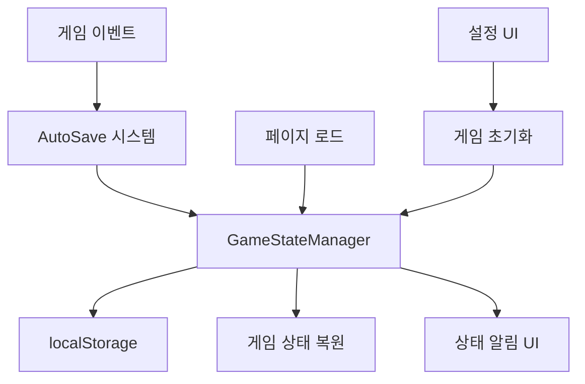

# Design Document: 게임 상태 관리 시스템

## Overview

이 디자인 문서는 게임 상태의 자동저장/자동불러오기 기능과 게임 초기화 기능을 구현하는 방법을 설명합니다. 현재 게임은 페이지를 새로고침하거나 닫으면 모든 진행 상황이 사라지는 문제가 있습니다. 새로운 시스템은 localStorage를 활용하여 게임 상태를 지속적으로 보존하고, 사용자가 원할 때 게임을 초기 상태로 리셋할 수 있는 기능을 제공합니다.

## Architecture

게임 상태 관리 시스템은 다음과 같은 구성 요소로 이루어집니다:

1. **GameStateManager 클래스**: 게임 상태의 저장, 불러오기, 초기화를 담당하는 메인 클래스
2. **AutoSave 시스템**: 게임 상태 변경을 감지하고 자동으로 저장하는 시스템
3. **UI 컴포넌트**: 저장/불러오기 상태 표시 및 게임 초기화 버튼
4. **데이터 검증**: 저장된 데이터의 무결성을 확인하는 시스템

### 시스템 아키텍처 다이어그램



## Components and Interfaces

### 1. GameStateManager 클래스

게임 상태 관리의 핵심 클래스입니다.

```javascript
class GameStateManager {
    constructor() {
        this.storageKey = 'worldbox-lite-game-state';
        this.backupKey = 'worldbox-lite-backup';
        this.autoSaveInterval = 30000; // 30초마다 자동저장
        this.maxBackups = 5;
        this.isLoading = false;
        this.isSaving = false;
    }
    
    // 게임 상태 저장
    saveGameState(showNotification = true) { }
    
    // 게임 상태 불러오기
    loadGameState() { }
    
    // 게임 초기화
    resetGame() { }
    
    // 데이터 검증
    validateGameData(data) { }
    
    // 백업 관리
    createBackup() { }
    cleanupOldBackups() { }
}
```

### 2. AutoSave 시스템

게임 상태 변경을 감지하고 자동으로 저장하는 시스템입니다.

```javascript
class AutoSaveSystem {
    constructor(gameStateManager) {
        this.gameStateManager = gameStateManager;
        this.saveQueue = [];
        this.isProcessing = false;
        this.debounceTimer = null;
    }
    
    // 자동저장 트리거
    triggerAutoSave(reason = 'auto') { }
    
    // 게임 이벤트 리스너 설정
    setupEventListeners() { }
    
    // 디바운스된 저장
    debouncedSave() { }
}
```

### 3. UI 상태 표시 컴포넌트

저장/불러오기 상태를 사용자에게 표시하는 UI 컴포넌트입니다.

```html
<!-- 상태 알림 컨테이너 -->
<div id="game-state-notifications" class="state-notifications">
    <!-- 동적으로 생성되는 알림들 -->
</div>

<!-- 설정 탭에 추가될 게임 초기화 섹션 -->
<div class="game-state-section">
    <h2>게임 데이터 관리</h2>
    <div class="data-info">
        <p>저장된 데이터 크기: <span id="data-size">계산 중...</span></p>
        <p>마지막 저장: <span id="last-save-time">없음</span></p>
    </div>
    <div class="data-controls">
        <button id="manual-save-btn" class="action-btn">수동 저장</button>
        <button id="reset-game-btn" class="danger-btn">게임 초기화</button>
        <button id="clear-data-btn" class="danger-btn">모든 데이터 삭제</button>
    </div>
</div>
```

## Data Models

### 게임 상태 데이터 구조

```javascript
const gameStateSchema = {
    version: "1.0.0",
    timestamp: Date.now(),
    gameData: {
        // 국가 데이터
        nations: [],
        nextNationId: 1,
        selectedNation: null,
        
        // 맵 데이터
        mapData: {
            terrainMap: [],
            nationMap: [],
            cityMap: [],
            provinceMap: [],
            provinceNames: []
        },
        
        // 게임 설정
        gameSettings: {
            currentYear: 0,
            simulationRunning: false,
            worldAggression: 'balanced',
            rebellionFrequency: 'medium',
            simSpeed: 'medium'
        },
        
        // 맵 뷰 설정
        viewSettings: {
            zoomLevel: 1,
            panX: 0,
            panY: 0,
            mapWidth: 1200,
            mapHeight: 800
        }
    }
};
```

### 백업 데이터 구조

```javascript
const backupSchema = {
    backups: [
        {
            id: "backup_timestamp",
            timestamp: Date.now(),
            reason: "auto|manual|before_reset",
            data: gameStateSchema
        }
    ]
};
```

## Error Handling

### 1. 저장 실패 처리

```javascript
// localStorage 용량 초과
if (error.name === 'QuotaExceededError') {
    // 오래된 백업 삭제
    this.cleanupOldBackups();
    // 재시도
    this.saveGameState();
}

// 일반적인 저장 오류
catch (error) {
    console.error('게임 저장 실패:', error);
    this.showErrorNotification('저장 실패', '게임 상태를 저장할 수 없습니다.');
}
```

### 2. 불러오기 실패 처리

```javascript
// 데이터 손상
if (!this.validateGameData(data)) {
    console.warn('저장된 데이터가 손상되었습니다. 기본 상태로 시작합니다.');
    this.showWarningNotification('데이터 복원 실패', '저장된 데이터가 손상되어 새 게임으로 시작합니다.');
    return false;
}

// 버전 호환성 문제
if (data.version !== this.currentVersion) {
    console.warn('저장된 데이터 버전이 호환되지 않습니다.');
    this.migrateData(data);
}
```

### 3. 용량 관리

```javascript
// 저장 공간 모니터링
getStorageUsage() {
    const used = JSON.stringify(localStorage).length;
    const quota = 5 * 1024 * 1024; // 5MB 추정
    return { used, quota, percentage: (used / quota) * 100 };
}

// 자동 정리
if (storageUsage.percentage > 80) {
    this.cleanupOldBackups();
    this.showWarningNotification('저장 공간 부족', '오래된 백업을 정리했습니다.');
}
```

## Testing Strategy

### 1. 단위 테스트

```javascript
// GameStateManager 테스트
describe('GameStateManager', () => {
    test('게임 상태 저장', () => {
        const manager = new GameStateManager();
        const result = manager.saveGameState();
        expect(result).toBe(true);
    });
    
    test('데이터 검증', () => {
        const manager = new GameStateManager();
        const validData = { version: '1.0.0', gameData: {} };
        expect(manager.validateGameData(validData)).toBe(true);
    });
});
```

### 2. 통합 테스트

```javascript
// 전체 워크플로우 테스트
describe('게임 상태 관리 워크플로우', () => {
    test('저장 후 불러오기', () => {
        // 게임 상태 생성
        // 저장
        // 페이지 새로고침 시뮬레이션
        // 불러오기
        // 상태 비교
    });
});
```

### 3. 사용자 시나리오 테스트

- 게임 진행 중 브라우저 종료 후 재시작
- 저장 공간 부족 상황 처리
- 손상된 데이터 복구
- 게임 초기화 기능

## 구현 세부사항

### 1. 자동저장 트리거 이벤트

```javascript
// 국가 관련 이벤트
- 국가 추가/삭제
- 국가 속성 변경
- 유닛 추가
- 전쟁/동맹 상태 변경

// 맵 관련 이벤트
- 지형 변경
- 도시 추가/삭제
- 영토 변경

// 게임 설정 이벤트
- 시뮬레이션 시작/중지
- 설정 변경
```

### 2. 성능 최적화

```javascript
// 디바운싱으로 과도한 저장 방지
const debouncedSave = debounce(() => {
    this.gameStateManager.saveGameState();
}, 1000);

// 압축을 통한 저장 공간 절약
const compressedData = LZString.compress(JSON.stringify(gameData));
localStorage.setItem(this.storageKey, compressedData);
```

### 3. UI 피드백

```css
/* 저장 상태 알림 스타일 */
.state-notification {
    position: fixed;
    top: 20px;
    right: 20px;
    padding: 12px 20px;
    border-radius: 6px;
    color: white;
    font-weight: bold;
    z-index: 10000;
    animation: slideIn 0.3s ease;
}

.notification-success { background-color: #10B981; }
.notification-error { background-color: #EF4444; }
.notification-warning { background-color: #F59E0B; }
.notification-info { background-color: #3B82F6; }
```

## 보안 고려사항

1. **데이터 검증**: 불러온 데이터의 구조와 타입을 엄격히 검증
2. **XSS 방지**: 사용자 입력 데이터 (국가명 등)를 안전하게 처리
3. **용량 제한**: 악의적인 대용량 데이터 저장 방지
4. **버전 관리**: 데이터 스키마 버전을 통한 호환성 보장

## 결론

이 게임 상태 관리 시스템은 사용자 경험을 크게 개선할 것입니다. 자동저장 기능으로 진행 상황이 보존되고, 직관적인 UI를 통해 게임 데이터를 관리할 수 있습니다. 또한 강력한 오류 처리와 데이터 검증을 통해 안정적인 게임 환경을 제공합니다.